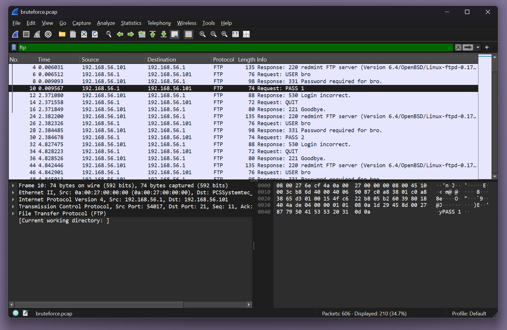
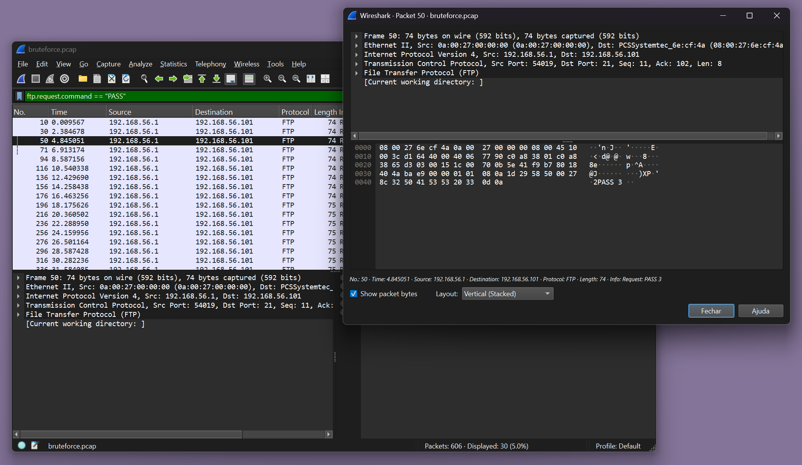

# 🔐 Detecção de Ataque Brute Force FTP com Wireshark

[]()
[]()
[]()

## 📦 wireshark-brute-force/
```bash
├── images/                         <- Capturas de tela da análise
│   ├── 1-wireshark-ftp-bruteforce.png
│   ├── 2-wireshark-bruteforce-loginIn.png
│   └── 3-wireshark-bruteforce-pass.png
├── ftp_bruteforce_capture.pcap     <- Arquivo da captura de tráfego (se quiser incluir)
└── README.md                       <- Este arquivo
```

## 🧠 Objetivo
Identificar comportamento suspeito em uma captura de tráfego de rede (PCAP) que indica um ataque de força bruta via FTP. Esse tipo de análise é uma habilidade chave para SOC Analysts, que precisam detectar atividades maliciosas com base em logs/pacotes.

## 🔍 Contexto
Utilizamos o arquivo `bruteforce.pcap` (fonte: repositório oficial do Zeek) e abrimos no **Wireshark** para investigar tentativas de login suspeitas no serviço **FTP (porta 21)**.

## 📸 Evidências da Análise

### 🖼️ 1. Múltiplas Tentativas de Login com Usuário "bro"


- Requisições `USER bro` e `PASS 1`, `PASS 2`, `PASS 3`, etc.
- Origem: `192.168.56.1` → Destino: `192.168.56.101`
- O mesmo IP tenta acessar repetidamente o servidor com senhas diferentes.
- Isso **caracteriza força bruta**: várias tentativas automáticas até acertar a senha.

### 🖼️ 2. Respostas Repetidas de Erro: `530 Login incorrect`


- Usando o filtro: `ftp.response.arg == "Login incorrect."`
- Várias respostas do servidor negando o login (erro 530).
- Isso indica que as tentativas estão **falhando**, mas continuam sendo feitas.
- Esse padrão é comum em ataques de brute force automatizados.

### 🖼️ 3. Tentativas de Senhas com o Comando `PASS`


- Filtro: `ftp.request.command == "PASS"`
- Mostra diversas tentativas de senha (`PASS 1`, `PASS 2`, `PASS 3`...)
- IP de origem continua testando senhas em sequência.
- Isso **reforça o comportamento automatizado**, sem interação humana real.

## ✅ Conclusão

Este tráfego mostra claramente um **ataque de brute force via FTP**:  
- IP fixo tentando diversas senhas em sequência.  
- Respostas de erro repetitivas do servidor.  
- Padrão automático e persistente.

📌 Um analista de SOC deve saber identificar esse tipo de padrão rapidamente, tanto para **bloquear o IP** quanto para **reportar o incidente internamente**.

## 🧰 Ferramentas usadas
- 🐍 Wireshark  
- 📄 Arquivo PCAP: `bruteforce.pcap`  
